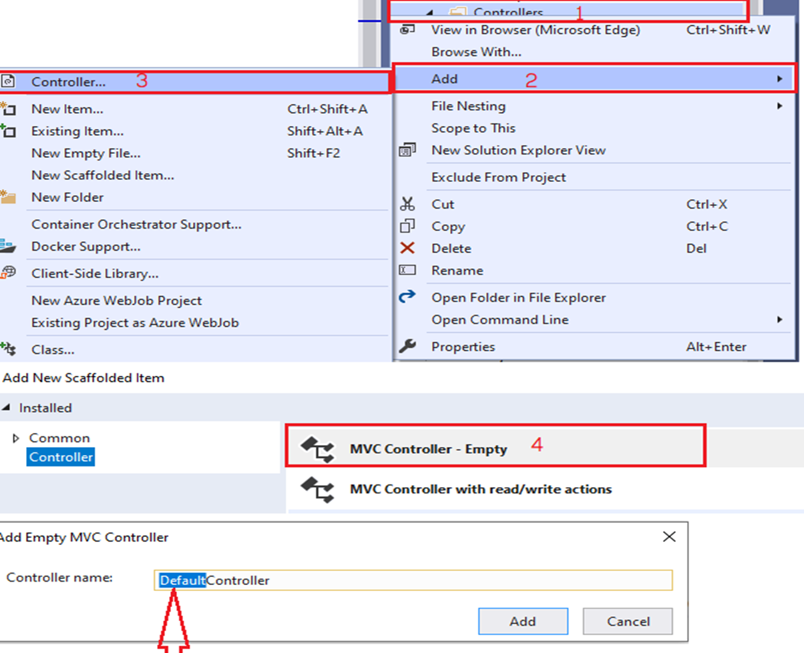
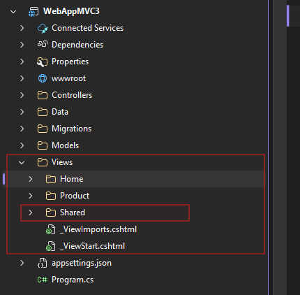

# សប្តាហ៍ទី៥ – Controllers & Views

### 1. Controller

Controller ជា C# class ដែលប្រមូលផ្តុំដោយpublic methods។

- គ្រប់គ្រង user’s request(handle the user’s request)
- បង្កើត model (create model)វាតំណើរការ(execute)នូវ application logicហើយបង្កើត model។
- និងបញ្ជួនចំលើយតបទៅ user វិញ(send the response)ជាចុងក្រោយវានិងបោះតំលៃត្រឡឡប់ទៅវិញក្នុងទំរង់ជា​ html/json/xmlឬទំរង់ផ្សេងទៀតដែលអ្នកប្រើប្រាស់បានស្នើរសុំ។

#### 1.2 ការបង្កើត controller

- ចុចម៉ៅស្តាំលើថត controllers
- ចុចពាក្យថា add  controller
- ជ្រើសរើស controller template  MVC empty  Add
- ដាក់ឈ្មោះcontroller(ឈ្មោះ controller ត្រូវបញ្ចប់ដោយController)
- រួចហើយចុចពាក្ស Add
  

#### 1.3 Action Methods ក្នុង Controller

Action method គឺជា method ក្នុង class Controller ដែល៖

- ទទួលសំណើ (HTTP request)
- ធ្វើការងារចាំបាច់ (ទាញទិន្នន័យ, គណនា, រក្សា...)
- ត្រឡប់លទ្ធផល (View, JSON, Redirect, File...)

`មើលមេរៀនលម្អិតអំពី Action Method`

| ប្រភេទ Action         | ឧទាហរណ៍                  | ការប្រើប្រាស់ទូទៅ                     |
| --------------------- | ------------------------ | ------------------------------------- |
| GET                   | Index(), Details(int id) | បង្ហាញទិន្នន័យ, បង្ហាញ Form           |
| POST                  | Create(), Edit()         | ទទួលទិន្នន័យពី Form, Save to Database |
| [HttpGet], [HttpPost] | បញ្ជាក់ច្បាស់លាស់        | ការពារការប្រើ GET សម្រាប់ POST        |

---

#### 1.4 វិធីផ្ទេរទិន្នន័យទៅ View (3 វិធីសំខាន់) ពី Controller

| វិធី         | ប្រភេទ             | លក្ខណៈពិសេស                          | ឧទាហរណ៍ក្នុង Controller            | ប្រើនៅ View យ៉ាងម៉េច?                   |
| ------------ | ------------------ | ------------------------------------ | ---------------------------------- | --------------------------------------- |
| **Model**    | Strongly-typed     | មាន type-safety, validation ល្អបំផុត | `return View(products);`           | `@model List<Product>`<br>`@Model.Name` |
| **ViewBag**  | dynamic            | ងាយស្រួល, មិនចាំបាច់ declare មុន     | `ViewBag.Title = "បញ្ជីផលិតផល";`   | `@ViewBag.Title`                        |
| **ViewData** | ViewDataDictionary | ដូច ViewBag ប៉ុន្តែជា Dictionary     | `ViewData["Message"] = "សួស្តី!";` | `@ViewData["Message"]`                  |

**ការប្រៀបធៀបសង្ខេប**

- ប្រើ **Model** នៅពេលមានទិន្នន័យសំខាន់ និងចង់ប្រើ validation
- ប្រើ **ViewBag** / **ViewData** សម្រាប់ទិន្នន័យបន្ថែម (title, message, count...)

[មើលលម្អិត](../../Views/3-Data_Controllers_to_Views.md)

---

## 2. Views

- View ជាអ្វីៗដែលអ្នកប្រើប្រាស់មើលនូវទិន្ន័យឃើញ(សម្រាប់បង្ហាញModel)លើbrowser ។
- View​ File មានកន្ទុយ\*.cshtml សម្រាប់C#។

[មើលមេរៀន Views](../../Views/1-Views.md)

#### 3.1 ទីតាំងសម្រាប់ទុកViews

- View File អាចនៅក្នុង៖
  - Views/<Controller  Name>/ViewName.cshtml
  - Views/Shared/ViewName.cshtml



#### 3.2 ការបង្កើត view?

- គ្រប់ views ទាំងអស់ត្រូវស្ថិតនៅក្នុងថត views/<Controller Name> ឬ views/Shared
- គ្រប់ views ដែលបោះតំលៃជា markup ត្រូវមានកន្ទុយជា \*.cshtml(C#)
- គេអាចបង្កើត view បានតាមពីរបៀបគឺ៖
  - ការបង្កើតចេញពី​ action method របស់​ controller ណាមួយ
  - និងទី២បង្កើតview ចេញពីថតរង (controller sub directory)ដោយផ្ទាល់តែម្តង

#### 2.3 Partial View

- **Partial View**  
  → View តូចៗដែលអាច reuse បាន (ឧ. \_ProductCard.cshtml, \_Pagination.cshtml)  
  → ដើម្បីបង្ហាញ partial view យើងប្រើ `@await Html.PartialAsync("_ProductCard", model)` ឬ `<partial name="..." />`

---

### ២. ឧទាហរណ៍បន្ថែម

#### ឧទាហរណ៍ ១៖ ProductsController បង្ហាញបញ្ជីផលិតផល

```csharp
public class ProductsController : Controller
{
    public IActionResult Index()
    {
        var products = new List<Product>
        {
            new Product { Id = 1, Name = "ទូរស័ព្ទ iPhone 14", Price = 899.00m, CategoryName = "គ្រឿងអេឡិចត្រូនិក" },
            new Product { Id = 2, Name = "អាវយឺត Nike", Price = 35.00m, CategoryName = "សម្លៀកបំពាក់" }
        };

        ViewBag.PageTitle = "បញ្ជីផលិតផលទាំងអស់";
        ViewData["TotalProducts"] = products.Count;

        return View(products);
    }
}
```

**Views/Products/Index.cshtml**

```
@model List<Product>

@{
    ViewData["Title"] = ViewBag.PageTitle;
}

<h1>@ViewData["Title"]</h1>
<p>ចំនួនផលិតផលសរុប៖ @ViewData["TotalProducts"]</p>

<table class="table table-striped">
    <thead>
        <tr>
            <th>ល.រ</th>
            <th>ឈ្មោះ</th>
            <th>តម្លៃ</th>
            <th>ប្រភេទ</th>
        </tr>
    </thead>
    <tbody>
        @foreach (var p in Model)
        {
            <tr>
                <td>@p.Id</td>
                <td>@p.Name</td>
                <td>@p.Price.ToString("C")</td>
                <td>@p.CategoryName</td>
            </tr>
        }
    </tbody>
</table>
```

---

#### ឧទាហរណ៍ ២៖ Partial View សម្រាប់ Product Card

**Views/Shared/\_ProductCard.cshtml**

```html
@model ECommerceApp.Models.Product

<div class="card mb-3" style="width: 18rem;">
  <div class="card-body">
    <h5 class="card-title">@Model.Name</h5>
    <p class="card-text">តម្លៃ៖ @Model.Price.ToString("C")</p>
    <p class="card-text text-muted">@Model.CategoryName</p>
    <a
      asp-controller="Products"
      asp-action="Details"
      asp-route-id="@Model.Id"
      class="btn btn-primary"
      >Details</a
    >
  </div>
</div>
```

**បញ្ចូលក្នុង Index.cshtml**

```html
<div class="row">
  @foreach (var product in Model) {
  <div class="col-md-4">@await Html.PartialAsync("_ProductCard", product)</div>
  }
</div>
```

---

### ៣. Lab សប្តាហ៍ទី៥

**គោលដៅ**

- បង្កើត static UI សម្រាប់បញ្ជីផលិតផល (Product listing)
- បង្កើតនិងប្រើ Layout template រួម
- ប្រើ Tag Helpers សម្រាប់ navigation

**ជំហាន Lab**

1. បង្កើត **Product.cs** (Model) ក្នុង folder Models

```csharp
public class Product
{
    public int Id { get; set; }
    public string Name { get; set; } = string.Empty;
    public decimal Price { get; set; }
    public string CategoryName { get; set; } = string.Empty;
}
```

2. បង្កើត **ProductsController** និង Action Index

3. បង្កើត **Views/Products/Index.cshtml** ដោយបង្ហាញតារាង ឬ card layout

4. កែ **\_Layout.cshtml** (Views/Shared)
   - បន្ថែម link “Products” ក្នុង navbar

5. បង្កើត **Partial View** \_ProductCard.cshtml នៅក្នុង Views/Shared  
   បន្ថែមក្នុង Index.cshtml ដោយប្រើ `@await Html.PartialAsync(...)`

6. Run និងសាកល្បង URL: `/Products` ឬ `/Products/Index`

**កិច្ចការ Bonus**

- បន្ថែម Action **Details(int id)** ដែលបង្ហាញព័ត៌មានផលិតផលតែមួយ
- បន្ថែម link “មើលលម្អិត” នៅក្នុងតារាង/កាតនីមួយៗ (ប្រើ Tag Helper `asp-action="Details" asp-route-id="..."`)
