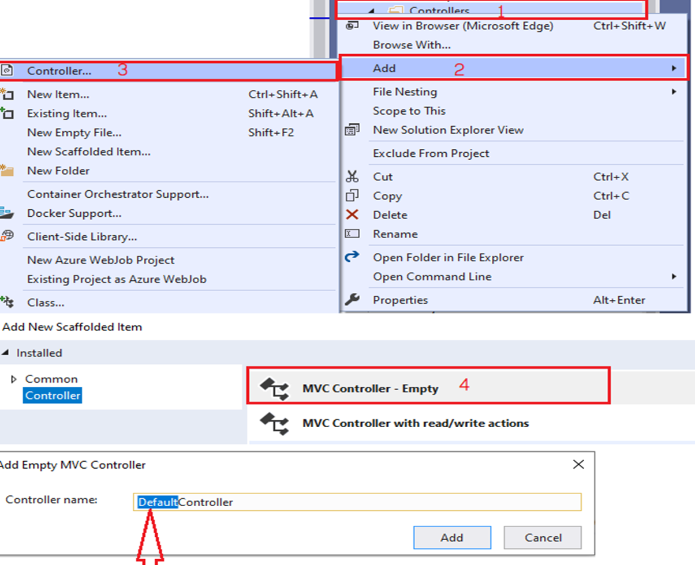

# សប្តាហ៍ទី៥ – Controllers

## 1. Controller

Controller ជា C# class ដែលប្រមូលផ្តុំដោយpublic methods។

- គ្រប់គ្រង user’s request(handle the user’s request)
- បង្កើត model (create model)វាតំណើរការ(execute)នូវ application logicហើយបង្កើត model។
- និងបញ្ជួនចំលើយតបទៅ user វិញ(send the response)ជាចុងក្រោយវានិងបោះតំលៃត្រឡឡប់ទៅវិញក្នុងទំរង់ជា​ html/json/xmlឬទំរង់ផ្សេងទៀតដែលអ្នកប្រើប្រាស់បានស្នើរសុំ។

### 1.1 ការបង្កើត controller

- ចុចម៉ៅស្តាំលើថត controllers
- ចុចពាក្យថា add -> controller
- ជ្រើសរើស controller template -> MVC empty -> Add
- ដាក់ឈ្មោះcontroller(ឈ្មោះ controller ត្រូវបញ្ចប់ដោយController)
- រួចហើយចុចពាក្ស -> Add
  

### 1.2 Action Methods ក្នុង Controller

Action method គឺជា method ក្នុង class Controller ដែល៖

- ទទួលសំណើ (HTTP request)
- ធ្វើការងារចាំបាច់ (ទាញទិន្នន័យ, គណនា, រក្សា...)
- ត្រឡប់លទ្ធផល (View, JSON, Redirect, File...)

`មើលមេរៀនលម្អិតអំពី Action Method`

| ប្រភេទ Action         | ឧទាហរណ៍                  | ការប្រើប្រាស់ទូទៅ                     |
| --------------------- | ------------------------ | ------------------------------------- |
| GET                   | Index(), Details(int id) | បង្ហាញទិន្នន័យ, បង្ហាញ Form           |
| POST                  | Create(), Edit()         | ទទួលទិន្នន័យពី Form, Save to Database |
| [HttpGet], [HttpPost] | បញ្ជាក់ច្បាស់លាស់        | ការពារការប្រើ GET សម្រាប់ POST        |

---

### 1.3 វិធីផ្ទេរទិន្នន័យទៅ View (3 វិធីសំខាន់) ពី Controller

| វិធី         | ប្រភេទ             | លក្ខណៈពិសេស                          | ឧទាហរណ៍ក្នុង Controller            | ប្រើនៅ View យ៉ាងម៉េច?                   |
| ------------ | ------------------ | ------------------------------------ | ---------------------------------- | --------------------------------------- |
| **Model**    | Strongly-typed     | មាន type-safety, validation ល្អបំផុត | `return View(products);`           | `@model List<Product>`<br>`@Model.Name` |
| **ViewBag**  | dynamic            | ងាយស្រួល, មិនចាំបាច់ declare មុន     | `ViewBag.Title = "បញ្ជីផលិតផល";`   | `@ViewBag.Title`                        |
| **ViewData** | ViewDataDictionary | ដូច ViewBag ប៉ុន្តែជា Dictionary     | `ViewData["Message"] = "សួស្តី!";` | `@ViewData["Message"]`                  |

**ការប្រៀបធៀបសង្ខេប**

- ប្រើ **Model** នៅពេលមានទិន្នន័យសំខាន់ និងចង់ប្រើ validation
- ប្រើ **ViewBag** / **ViewData** សម្រាប់ទិន្នន័យបន្ថែម (title, message, count...)

[មើលលម្អិត](../../Views/3-Data_Controllers_to_Views.md)

---

## 3. Lab Week 5

### ជំហានទី១: បង្កើត Model → Product.cs

នៅក្នុង folder **Models** បន្ថែម class ដូចខាងក្រោម៖

```csharp
namespace YourProjectName.Models
{
    public class Product
    {
        public int Id { get; set; }
        public string Name { get; set; } = string.Empty;
        public decimal Price { get; set; }
        public string CategoryName { get; set; } = string.Empty;
    }
}
```

(ប្តូរ `YourProjectName` ទៅជា namespace របស់ project របស់អ្នក)

### ជំហានទី២: បង្កើត ProductsController និង Action Index

នៅក្នុង folder **Controllers** បន្ថែម class ថ្មីឈ្មោះ **ProductsController.cs**

```csharp
using Microsoft.AspNetCore.Mvc;
using YourProjectName.Models; // ប្តូរ namespace ឲ្យត្រូវ
using System.Collections.Generic;

namespace YourProjectName.Controllers
{
    public class ProductsController : Controller
    {
        // បញ្ជីផលិតផលសម្រាប់សាកល្បង (ក្រោយមកប្តូរទៅ database)
        private static readonly List<Product> _products = new List<Product>
        {
            new Product { Id = 1, Name = "ទូរស័ព្ទ Samsung A55", Price = 399.99m, CategoryName = "ឧបករណ៍អេឡិចត្រូនិក" },
            new Product { Id = 2, Name = "កាសស្តាប់ Sony WH-1000XM5", Price = 349.00m, CategoryName = "ឧបករណ៍សំឡេង" },
            new Product { Id = 3, Name = "កុំព្យូទ័រ Laptop Dell XPS 13", Price = 1299.00m, CategoryName = "កុំព្យូទ័រ" },
            new Product { Id = 4, Name = "នាឡិកា Smartwatch Apple Watch Series 9", Price = 429.00m, CategoryName = "ឧបករណ៍ពាក់" }
        };

        // GET: /Products ឬ /Products/Index
        public IActionResult Index()
        {
            return View(_products);
        }
    }
}
```

### ជំហានទី៣: បង្កើត View → Views/Products/Index.cshtml

បង្កើត folder **Products** នៅក្នុង **Views** (បើមិនទាន់មាន) រួចបន្ថែម file **Index.cshtml**

```cshtml
@model IEnumerable<YourProjectName.Models.Product>

@{
    ViewData["Title"] = "បញ្ជីផលិតផល";
}

<h1 class="text-center mb-4">បញ្ជីផលិតផល</h1>

<div class="row row-cols-1 row-cols-md-3 g-4">
    @foreach (var product in Model)
    {
        <div class="col">
            @await Html.PartialAsync("_ProductCard", product)
        </div>
    }
</div>

@if (!Model.Any())
{
    <p class="text-center text-muted mt-5">មិនមានផលិតផលនៅឡើយទេ...</p>
}
```

(យើងប្រើ **Partial View** សម្រាប់ card ដើម្បីងាយស្រួលកែប្រែ)

### ជំហានទី៤: បង្កើត Partial View → Views/Shared/\_ProductCard.cshtml

បន្ថែម file ថ្មីនៅក្នុង **Views/Shared** ឈ្មោះ **\_ProductCard.cshtml**

```cshtml
@model YourProjectName.Models.Product

<div class="card h-100 shadow-sm">
    <div class="card-body">
        <h5 class="card-title">@Model.Name</h5>
        <p class="card-text text-muted">@Model.CategoryName</p>
        <p class="card-text fw-bold text-success">
            $@Model.Price.ToString("N2")
        </p>
    </div>
    <div class="card-footer bg-transparent border-0 text-center">
        <a asp-controller="Products" asp-action="Details" asp-route-id="@Model.Id"
           class="btn btn-outline-primary btn-sm">
            មើលលម្អិត
        </a>
    </div>
</div>
```

### ជំហានទី៥: កែប្រែ \_Layout.cshtml (បន្ថែម link “Products” ក្នុង navbar)

បើក file **Views/Shared/\_Layout.cshtml** រកផ្នែក `<nav>` ឬ `<ul class="navbar-nav">` រួចបន្ថែម link ដូចខាងក្រោម (ប្រើ Tag Helper):

```html
...
<nav class="navbar navbar-expand-lg navbar-dark bg-dark">
  <div class="container">
    <a class="navbar-brand" asp-controller="Home" asp-action="Index"
      >E-Commerce</a
    >
    <button
      class="navbar-toggler"
      type="button"
      data-bs-toggle="collapse"
      data-bs-target="#navbarNav"
    >
      <span class="navbar-toggler-icon"></span>
    </button>
    <div class="collapse navbar-collapse" id="navbarNav">
      <ul class="navbar-nav me-auto">
        <li class="nav-item">
          <a class="nav-link" asp-controller="Home" asp-action="Index">Home</a>
        </li>
        <li class="nav-item">
          <a class="nav-link" asp-controller="Products" asp-action="Index"
            >Products</a
          >
          <!-- Modify here-->
        </li>
      </ul>
    </div>
  </div>
</nav>
...
<main role="main" class="pb-3">@RenderBody()</main>
```

### ជំហាន Bonus: បន្ថែម Action Details និង View Details

1. បន្ថែម Action នៅក្នុង **ProductsController.cs**

```csharp
// GET: /Products/Details/5
public IActionResult Details(int? id)
{
    if (id == null) return NotFound();

    var product = _products.FirstOrDefault(p => p.Id == id);
    if (product == null) return NotFound();

    return View(product);
}
```

2. បន្ថែម View → **Views/Products/Details.cshtml**

```cshtml
@model YourProjectName.Models.Product

@{
    ViewData["Title"] = "ព័ត៌មានលម្អិតផលិតផល";
}

<h1 class="text-center mb-4">@Model.Name</h1>

<div class="card mx-auto" style="max-width: 500px;">
    <div class="card-body">
        <h4 class="card-title">@Model.Name</h4>
        <p class="card-text"><strong>ប្រភេទ៖</strong> @Model.CategoryName</p>
        <p class="card-text"><strong>តម្លៃ៖</strong> <span class="text-success fw-bold">$@Model.Price.ToString("N2")</span></p>
        <p class="card-text"><strong>ID៖</strong> @Model.Id</p>
    </div>
    <div class="card-footer text-center">
        <a asp-action="Index" class="btn btn-secondary">ត្រឡប់ទៅបញ្ជី</a>
    </div>
</div>
```

### ជំហានចុងក្រោយ: Run និងសាកល្បង

- Run project (F5 ឬ `dotnet run`)
- ចូលទៅ URL:
  - http://localhost:xxxx/Products ឬ http://localhost:xxxx/Products/Index
- គួរឃើញបញ្ជីផលិតផលជា card layout
- ចុច “មើលលម្អិត” គួរទៅទំព័រ Details បាន
